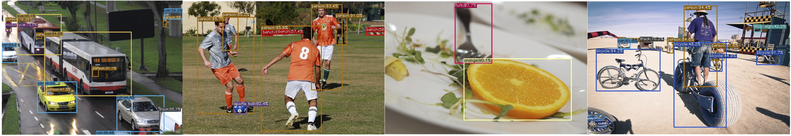
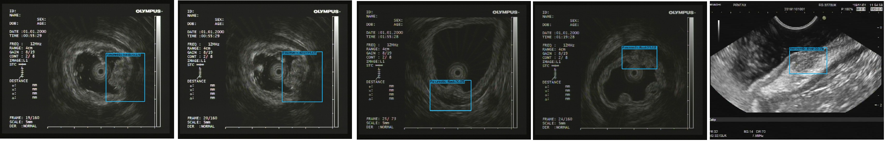
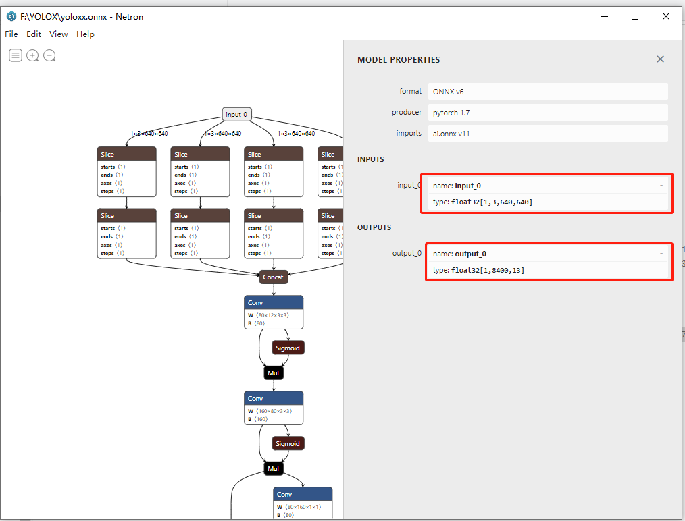
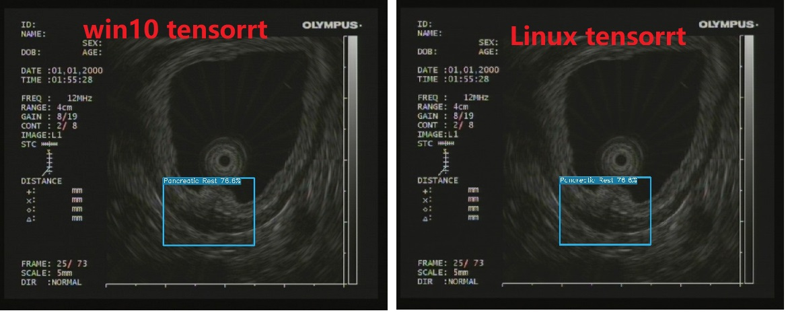

## :rocket:YOLOX 训练自己的模型

Xu Jing

#### :fire: :fire::fire:自定义数据集，模型训练， TensorRT C++模型加速，详细教程和代码:fire::fire::fire:

<div align="center"></div>





+ :bug:感谢旷视大佬开源：https://github.com/Megvii-BaseDetection/YOLOX
+ :bug:Arxiv: https://arxiv.org/abs/2107.08430

关于Paper的解读相对于同类型的paper较容易，作者在以自身实验的角度，在paper中重述了如何从YOLOv3找到YOLOX,细节可以参考上述提供的paper连接。


### 1.预训练模型下载

#### Standard Models.
| Model                                       | size | mAP<sup>test<br>0.5:0.95 | Speed V100<br>(ms) | Params<br>(M) | FLOPs<br>(G) |                           weights                            |
| ------------------------------------------- | :--: | :----------------------: | :----------------: | :-----------: | :----------: | :----------------------------------------------------------: |
| [YOLOX-s](./exps/default/yolox_s.py)        | 640  |           39.6           |        9.8         |      9.0      |     26.8     | [onedrive](https://megvii-my.sharepoint.cn/:u:/g/personal/gezheng_megvii_com/EW62gmO2vnNNs5npxjzunVwB9p307qqygaCkXdTO88BLUg?e=NMTQYw)/[github](https://github.com/Megvii-BaseDetection/storage/releases/download/0.0.1/yolox_s.pth) |
| [YOLOX-m](./exps/default/yolox_m.py)        | 640  |           46.4           |        12.3        |     25.3      |     73.8     | [onedrive](https://megvii-my.sharepoint.cn/:u:/g/personal/gezheng_megvii_com/ERMTP7VFqrVBrXKMU7Vl4TcBQs0SUeCT7kvc-JdIbej4tQ?e=1MDo9y)/[github](https://github.com/Megvii-BaseDetection/storage/releases/download/0.0.1/yolox_m.pth) |
| [YOLOX-l](./exps/default/yolox_l.py)        | 640  |           50.0           |        14.5        |     54.2      |    155.6     | [onedrive](https://megvii-my.sharepoint.cn/:u:/g/personal/gezheng_megvii_com/EWA8w_IEOzBKvuueBqfaZh0BeoG5sVzR-XYbOJO4YlOkRw?e=wHWOBE)/[github](https://github.com/Megvii-BaseDetection/storage/releases/download/0.0.1/yolox_l.pth) |
| [YOLOX-x](./exps/default/yolox_x.py)        | 640  |         **51.2**         |        17.3        |     99.1      |    281.9     | [onedrive](https://megvii-my.sharepoint.cn/:u:/g/personal/gezheng_megvii_com/EdgVPHBziOVBtGAXHfeHI5kBza0q9yyueMGdT0wXZfI1rQ?e=tABO5u)/[github](https://github.com/Megvii-BaseDetection/storage/releases/download/0.0.1/yolox_x.pth) |
| [YOLOX-Darknet53](./exps/default/yolov3.py) | 640  |           47.4           |        11.1        |     63.7      |    185.3     | [onedrive](https://megvii-my.sharepoint.cn/:u:/g/personal/gezheng_megvii_com/EZ-MV1r_fMFPkPrNjvbJEMoBLOLAnXH-XKEB77w8LhXL6Q?e=mf6wOc)/[github](https://github.com/Megvii-BaseDetection/storage/releases/download/0.0.1/yolox_darknet53.pth) |

#### Light Models.
| Model                                      | size | mAP<sup>val<br>0.5:0.95 | Params<br>(M) | FLOPs<br>(G) |                           weights                            |
| ------------------------------------------ | :--: | :---------------------: | :-----------: | :----------: | :----------------------------------------------------------: |
| [YOLOX-Nano](./exps/default/nano.py)       | 416  |          25.3           |     0.91      |     1.08     | [onedrive](https://megvii-my.sharepoint.cn/:u:/g/personal/gezheng_megvii_com/EdcREey-krhLtdtSnxolxiUBjWMy6EFdiaO9bdOwZ5ygCQ?e=yQpdds)/[github](https://github.com/Megvii-BaseDetection/storage/releases/download/0.0.1/yolox_nano.pth) |
| [YOLOX-Tiny](./exps/default/yolox_tiny.py) | 416  |          31.7           |     5.06      |     6.45     | [onedrive](https://megvii-my.sharepoint.cn/:u:/g/personal/gezheng_megvii_com/EYtjNFPqvZBBrQ-VowLcSr4B6Z5TdTflUsr_gO2CwhC3bQ?e=SBTwXj)/[github](https://github.com/Megvii-BaseDetection/storage/releases/download/0.0.1/yolox_tiny.pth) |


### 2.环境安装

1.创建虚拟环境

```shell
git clone https://github.com/Megvii-BaseDetection/YOLOX
cd YOLOX
virtualenv -p /usr/bin/python3.7 yoloxenv

source yoloxenv/bin/activate
```

2.安装必要的package

```shell
pip install -r requirements.txt 
```

3.安装YOLOX

```shell
#pip install -v -e .  
# 建议的安装方式
python setup.py develop
```

4.安装[apex](https://github.com/NVIDIA/apex)

```shell
# 用于Pytorch的混合精度训练
# skip this step if you don't want to train model.
git clone https://github.com/NVIDIA/apex
cd apex
# pip install -v --disable-pip-version-check --no-cache-dir --global-option="--cpp_ext" --global-option="--cuda_ext" ./
# 建议安装方式
python setup.py install

```

5.安装pycocotools

```shell
pip install cython; pip3 install 'git+https://github.com/cocodataset/cocoapi.git#subdirectory=PythonAPI'
```


### 3.数据集准备

YOLOX的训练支持COCO和VOC的数据格式，这里我们以VOC数据格式的数据集为例，详细讲解，如何自定义数据集训练自己的YOLOX模型！

1.数据标注

通过一些通用的数据标注工具标注数据比如：LabelImg, [Labelme](https://github.com/wkentaro/labelme), [CVAT](https://github.com/openvinotoolkit/cvat)，标注数据过程中注意标注精度，标签的一致性，注意对训练图像的审核等，尽量确保标注数据是干净合规的。

2.VOC数据集样式

将数据集存放在`datasets`文件夹下，其文件结构如：

```shell

./datasets/eus        #数据集存放在datasets文件夹，数据集的名字：eus
├─Annotations         #VOC标注文件存放的文件夹        
│      test1.xml      #具体的标注文件
│      test2.xml
├─JPEGImages          #Image存放的文件夹
│      test1.jpg      #具体的图片
│      test2.jpg
│─ImageSets           #训练，验证图片列表：注意每一行存放的是文件名字比如：test1
│────Main
│      train.txt
│      val.txt
└

```

恭喜你，按照上述文件结构，数据集就做好了！！！

3.修改DataLoader类加载自定义VOC格式数据集

+ 新建`voc_classes_eus.py`

```python
# 这里存放了训练集中所有的类别，其顺序即是label id,你也可以在代码中重新指定classes
VOC_CLASSES = (  #<------------不应该包含背景类别，类别个数中也不应该加入背景类别！
    "Lioxxx", 
    "Lipxxx", 
    "Pancxxx", 
    "GIxx", 
    "Cyxx",  
    "Nxx", 
    "Canxxx"，
    "Normal"
)
```


+ 新建`voc_eus.py`:基于自定义VOC格式的数据集修改该py文件

```python
# 该部分代码主要是通过Pytorch加载标注文件和图片，计算detector的评价指标coco AP和 VOC mAP
# 关于数据增强部分，在其他文件中存放主要用到了mosiac和mixup,建议小模型不要使用数据增强，大模型或小数据集建议使用数据增强
# 线下验证，医学数据及的数据增强意义不是很大
import cv2
import numpy as np

from yolox.evaluators.voc_eval import voc_eval

import os
import os.path
import pickle
import xml.etree.ElementTree as ET

from .datasets_wrapper import Dataset
from .voc_classes_eus import VOC_CLASSES # <----------------自定义的 clas label


class AnnotationTransform(object):

    """Transforms a VOC annotation into a Tensor of bbox coords and label index
    Initilized with a dictionary lookup of classnames to indexes

    Arguments:
        class_to_ind (dict, optional): dictionary lookup of classnames -> indexes
            (default: alphabetic indexing of VOC's 20 classes)
        keep_difficult (bool, optional): keep difficult instances or not
            (default: False)
        height (int): height
        width (int): width
    """

    def __init__(self, class_to_ind=None, keep_difficult=True):
        self.class_to_ind = class_to_ind or dict(zip(VOC_CLASSES, range(len(VOC_CLASSES))))
        self.keep_difficult = keep_difficult

    def __call__(self, target):
        """
        Arguments:
            target (annotation) : the target annotation to be made usable
                will be an ET.Element
        Returns:
            a list containing lists of bounding boxes  [bbox coords, class name]
        """
        res = np.empty((0, 5))
        for obj in target.iter("object"):
            difficult = int(obj.find("difficult").text) == 1
            if not self.keep_difficult and difficult:
                continue
            # name = obj.find("name").text.lower().strip()  # <-------------不需要变小写
            name = obj.find("name").text.strip()

            bbox = obj.find("bndbox")

            pts = ["xmin", "ymin", "xmax", "ymax"]
            bndbox = []
            for i, pt in enumerate(pts):
                cur_pt = int(bbox.find(pt).text) - 1
                # scale height or width
                # cur_pt = cur_pt / width if i % 2 == 0 else cur_pt / height
                bndbox.append(cur_pt)
            label_idx = self.class_to_ind[name]
            bndbox.append(label_idx)
            res = np.vstack((res, bndbox))  # [xmin, ymin, xmax, ymax, label_ind]
            # img_id = target.find('filename').text[:-4]

        return res  # [[xmin, ymin, xmax, ymax, label_ind], ... ]


class VOCDetection(Dataset):

    """
    VOC Detection Dataset Object

    input is image, target is annotation

    Args:
        root (string): filepath to VOCdevkit folder.
        image_set (string): imageset to use (eg. 'train', 'val', 'test')
        transform (callable, optional): transformation to perform on the
            input image
        target_transform (callable, optional): transformation to perform on the
            target `annotation`
            (eg: take in caption string, return tensor of word indices)
        dataset_name (string, optional): which dataset to load
            (default: 'VOC2007')
    """

    def __init__(
        self,
        data_dir,
        # image_sets=[('eus', 'train'), ('eus', 'val')], #<-----------没有年份的需求
        img_size=(416, 416),
        preproc=None,
        target_transform=AnnotationTransform(),
        dataset_mode="train",  # Main/train.txt  / val.txt  # <----------------训练模式
    ):
        super().__init__(img_size)
        self.root = data_dir   # ./datasets/eus
        # self.image_set = image_sets
        self.img_size = img_size
        self.preproc = preproc
        self.target_transform = target_transform
        self.name = dataset_mode
        self._annopath = os.path.join(self.root, "Annotations", "%s.xml")
        self._imgpath = os.path.join(self.root, "JPEGImages", "%s.jpg")
        self._classes = VOC_CLASSES
        self.ids = list()
        # for (year, name) in image_sets:   # <-------------这一部分不需要，调整为注释下方代码
        #     self._year = year
        #     rootpath = os.path.join(self.root + year)
        #     for line in open(
        #         os.path.join(rootpath, "ImageSets", "Main", name + ".txt")
        #     ):
        #         self.ids.append((rootpath, line.strip()))

        for line in open(
            os.path.join(self.root, "ImageSets", "Main", self.name + ".txt")
        ):
            # self.ids.append((rootpath, line.strip()))
            self.ids.append(line.strip())  # <-------------只存文件名


    def __len__(self):
        return len(self.ids)

    def load_anno(self, index):
        img_id = self.ids[index]
        if os.path.exists(self._annopath % img_id):
            target = ET.parse(self._annopath % img_id).getroot()
            if self.target_transform is not None:
                target = self.target_transform(target)
        else: # <--------------------不存在标注文件 

            target = None


        return target

    def pull_item(self, index):
        """Returns the original image and target at an index for mixup

        Note: not using self.__getitem__(), as any transformations passed in
        could mess up this functionality.

        Argument:
            index (int): index of img to show
        Return:
            img, target
        """
        img_id = self.ids[index]
        img = cv2.imread(self._imgpath % img_id, cv2.IMREAD_COLOR)
        height, width, _ = img.shape

        target = self.load_anno(index)
        # <---------------------------没有标注怎么办？
        if target is None:
            target = np.array([[10,10,width-10,height-10,7]],dtype=np.float32)

        img_info = (height, width)

        return img, target, img_info, index

    @Dataset.resize_getitem
    def __getitem__(self, index):
        img, target, img_info, img_id = self.pull_item(index)

        if self.preproc is not None:
            img, target = self.preproc(img, target, self.input_dim)

        return img, target, img_info, img_id

    def evaluate_detections(self, all_boxes, output_dir=None):
        """
        all_boxes is a list of length number-of-classes.
        Each list element is a list of length number-of-images.
        Each of those list elements is either an empty list []
        or a numpy array of detection.

        all_boxes[class][image] = [] or np.array of shape #dets x 5
        """
        self._write_voc_results_file(all_boxes)
        IouTh = np.linspace(0.5, 0.95, int(np.round((0.95 - 0.5) / 0.05)) + 1, endpoint=True)
        mAPs = []
        for iou in IouTh:
            mAP = self._do_python_eval(output_dir, iou)
            mAPs.append(mAP)

        print("--------------------------------------------------------------")
        print("map_5095:", np.mean(mAPs))
        print("map_50:", mAPs[0])
        print("--------------------------------------------------------------")
        return np.mean(mAPs), mAPs[0]

    def _get_voc_results_file_template(self):
        filename = "comp4_det_test" + "_{:s}.txt"
        filedir = os.path.join(self.root, "results", "Main")
        if not os.path.exists(filedir):
            os.makedirs(filedir)
        path = os.path.join(filedir, filename)
        return path

    def _write_voc_results_file(self, all_boxes):
        for cls_ind, cls in enumerate(VOC_CLASSES):
            cls_ind = cls_ind
            if cls == "__background__":
                continue
            print("Writing {} VOC results file".format(cls))
            filename = self._get_voc_results_file_template().format(cls)
            with open(filename, "wt") as f:
                for im_ind, index in enumerate(self.ids):
                    index = index[1]
                    dets = all_boxes[cls_ind][im_ind]
                    if dets == []:
                        continue
                    for k in range(dets.shape[0]):
                        f.write(
                            "{:s} {:.3f} {:.1f} {:.1f} {:.1f} {:.1f}\n".format(
                                index,
                                dets[k, -1],
                                dets[k, 0] + 1,
                                dets[k, 1] + 1,
                                dets[k, 2] + 1,
                                dets[k, 3] + 1,
                            )
                        )

    def _do_python_eval(self, output_dir="output", iou=0.5):
        # rootpath = os.path.join(self.root, "VOC" + self._year)
        rootpath = self.root

        # name = self.image_set[0][1]  # train_val
        name = self.name
        annopath = os.path.join(rootpath, "Annotations", "{:s}.xml")
        imagesetfile = os.path.join(rootpath, "ImageSets", "Main", name + ".txt")
        cachedir = os.path.join(
            self.root, "annotations_cache")
        if not os.path.exists(cachedir):
            os.makedirs(cachedir)
        aps = []
        # The PASCAL VOC metric changed in 2010
        # use_07_metric = True if int(self._year) < 2010 else False
        use_07_metric = True  # False (2010 metric)

        print("Eval IoU : {:.2f}".format(iou))
        if output_dir is not None and not os.path.isdir(output_dir):
            os.mkdir(output_dir)
        for i, cls in enumerate(VOC_CLASSES):

            if cls == "__background__":
                continue

            filename = self._get_voc_results_file_template().format(cls)
            rec, prec, ap = voc_eval(
                filename,
                annopath,
                imagesetfile,
                cls,
                cachedir,
                ovthresh=iou,
                use_07_metric=use_07_metric,
            )
            aps += [ap]
            if iou == 0.5:
                print("AP for {} = {:.4f}".format(cls, ap))
            if output_dir is not None:
                with open(os.path.join(output_dir, cls + "_pr.pkl"), "wb") as f:
                    pickle.dump({"rec": rec, "prec": prec, "ap": ap}, f)
        if iou == 0.5:
            print("Mean AP = {:.4f}".format(np.mean(aps)))
            print("~~~~~~~~")
            print("Results:")
            for ap in aps:
                print("{:.3f}".format(ap))
            print("{:.3f}".format(np.mean(aps)))
            print("~~~~~~~~")
            print("")
            print("--------------------------------------------------------------")
            print("Results computed with the **unofficial** Python eval code.")
            print("Results should be very close to the official MATLAB eval code.")
            print("Recompute with `./tools/reval.py --matlab ...` for your paper.")
            print("-- Thanks, The Management")
            print("--------------------------------------------------------------")

        return np.mean(aps)

```

:baby_bottle:注意：如果使用数据增强：`Mosiac` 和 `MixUp`，还需要修改上面代码中的`pull_item`和`load_anno`函数，这里我们不做任何数据增强，因为我们发现对于我们的数据集不做数据增强效果反而更好。这里要明白的是为什么做数据增强需要修改这两个方法，因为对于图像做了相应的数据增强，标注的bounding box也要做相同的操作才可以，这样才能保证数据的一致性！

+ 修改`__init__.py`

```python
from .coco import COCODataset
from .coco_classes import COCO_CLASSES
from .datasets_wrapper import ConcatDataset, Dataset, MixConcatDataset
from .mosaicdetection import MosaicDetection
# from .voc import VOCDetection
from .voc_eus import VOCDetection  # <--------加载自己的类别
from .voc_classes_eus import VOC_CLASSES  # <--------加载自己的类别

```

4.修改`./evaluators/voc_eval.py`

```python
def parse_rec(filename):
    """ Parse a PASCAL VOC xml file """
    objects = []
    tree = ET.parse(filename)
    for obj in tree.findall("object"):
        obj_struct = {}
        obj_struct["name"] = obj.find("name").text
        obj_struct["pose"] = obj.find("pose").text
        # obj_struct["truncated"] = int(obj.find("truncated").text)  # <---------VOC标注是字符串不能转int,并且这个字段在这里没用用到
        obj_struct["difficult"] = int(obj.find("difficult").text)
        bbox = obj.find("bndbox")
        obj_struct["bbox"] = [
            int(bbox.find("xmin").text),
            int(bbox.find("ymin").text),
            int(bbox.find("xmax").text),
            int(bbox.find("ymax").text),
        ]
        objects.append(obj_struct)

    return objects

```


```python
def voc_eval(
    detpath,
    annopath,
    imagesetfile,
    classname,
    cachedir,
    ovthresh=0.5,
    use_07_metric=False,
):
    # first load gt
    if not os.path.isdir(cachedir):
        os.mkdir(cachedir)
    cachefile = os.path.join(cachedir, "annots.pkl")
    # read list of images
    with open(imagesetfile, "r") as f:
        lines = f.readlines()
    imagenames = [x.strip() for x in lines]

    if not os.path.isfile(cachefile):
        # load annots
        recs = {}
        for i, imagename in enumerate(imagenames):
            # 没有xml标注文件不做统计！！！   # <--------------------有些图像没有标注文件，没有标注文件的辅助类别不计算mAP!
            if not os.path.exists(annopath.format(imagename)):
                continue
            recs[imagename] = parse_rec(annopath.format(imagename))
            if i % 100 == 0:
                print("Reading annotation for {:d}/{:d}".format(i + 1, len(imagenames)))
        # save
        print("Saving cached annotations to {:s}".format(cachefile))
        with open(cachefile, "wb") as f:
            pickle.dump(recs, f)
    else:
        # load
        with open(cachefile, "rb") as f:
            recs = pickle.load(f)

    # extract gt objects for this class
    class_recs = {}
    npos = 0
    for imagename in imagenames:
        R = [obj for obj in recs[imagename] if obj["name"] == classname]
        bbox = np.array([x["bbox"] for x in R])
        difficult = np.array([x["difficult"] for x in R]).astype(np.bool)
        det = [False] * len(R)
        npos = npos + sum(~difficult)
        class_recs[imagename] = {"bbox": bbox, "difficult": difficult, "det": det}

    # read dets
    detfile = detpath.format(classname)
    with open(detfile, "r") as f:
        lines = f.readlines()

    if len(lines) == 0:
        return 0, 0, 0

    splitlines = [x.strip().split(" ") for x in lines]
    image_ids = [x[0] for x in splitlines]
    confidence = np.array([float(x[1]) for x in splitlines])
    BB = np.array([[float(z) for z in x[2:]] for x in splitlines])

    # sort by confidence
    sorted_ind = np.argsort(-confidence)
    BB = BB[sorted_ind, :]
    image_ids = [image_ids[x] for x in sorted_ind]

    # go down dets and mark TPs and FPs
    nd = len(image_ids)
    tp = np.zeros(nd)
    fp = np.zeros(nd)
    for d in range(nd):
        R = class_recs[image_ids[d]]
        bb = BB[d, :].astype(float)
        ovmax = -np.inf
        BBGT = R["bbox"].astype(float)

        if BBGT.size > 0:
            # compute overlaps
            # intersection
            ixmin = np.maximum(BBGT[:, 0], bb[0])
            iymin = np.maximum(BBGT[:, 1], bb[1])
            ixmax = np.minimum(BBGT[:, 2], bb[2])
            iymax = np.minimum(BBGT[:, 3], bb[3])
            iw = np.maximum(ixmax - ixmin + 1.0, 0.0)
            ih = np.maximum(iymax - iymin + 1.0, 0.0)
            inters = iw * ih

            # union
            uni = (
                (bb[2] - bb[0] + 1.0) * (bb[3] - bb[1] + 1.0)
                + (BBGT[:, 2] - BBGT[:, 0] + 1.0) * (BBGT[:, 3] - BBGT[:, 1] + 1.0)
                - inters
            )

            overlaps = inters / uni
            ovmax = np.max(overlaps)
            jmax = np.argmax(overlaps)

        if ovmax > ovthresh:
            if not R["difficult"][jmax]:
                if not R["det"][jmax]:
                    tp[d] = 1.0
                    R["det"][jmax] = 1
                else:
                    fp[d] = 1.0
        else:
            fp[d] = 1.0

        # compute precision recall
    fp = np.cumsum(fp)
    tp = np.cumsum(tp)
    rec = tp / float(npos)
    # avoid divide by zero in case the first detection matches a difficult
    # ground truth
    prec = tp / np.maximum(tp + fp, np.finfo(np.float64).eps)
    ap = voc_ap(rec, prec, use_07_metric)

    return rec, prec, ap

```


5.修改exp配置文件使用YOLOX-x训练自定义数据集的配置文件

该配置文件主要配置了YOLOX的训练的超参数，比如数据集的加载路径，训练周期，学习率调整策略，评价指标，模型的backbone等等。

+ 在`exps`文件夹下新建`eus_voc`文件夹，并在该文件夹下新建`yolox_voc_x.py`

```python
# encoding: utf-8
import os
import random
import torch
import torch.nn as nn
import torch.distributed as dist

from yolox.exp import Exp as MyExp
from yolox.data import get_yolox_datadir

class Exp(MyExp):
    def __init__(self):
        super(Exp, self).__init__()
        self.num_classes = 8   # <----------------添加了辅助类别normal
        self.depth = 1.33      # <-------------------YOLOX-x
        self.width = 1.25
        self.exp_name = os.path.split(os.path.realpath(__file__))[1].split(".")[0]

        self.input_size = (640,640)  # <-----------------图像大小
        self.test_size = (640,640)
        self.max_epoch = 300        # <--------------训练周期
        # <---------------注意这里还有其他超参数，比如学习率相关的，可以参考exp_base!

    def get_data_loader(self, batch_size, is_distributed, no_aug=False):
        from yolox.data import (
            VOCDetection,
            TrainTransform,
            YoloBatchSampler,
            DataLoader,
            InfiniteSampler,
            MosaicDetection,
        )

        dataset = VOCDetection(   # <---------------要和我们修改的参数对应起来
            data_dir=os.path.join(get_yolox_datadir(), "eus"),
            # image_sets=[('2007', 'trainval'), ('2012', 'trainval')],
            img_size=self.input_size,
            preproc=TrainTransform(
                rgb_means=(0.485, 0.456, 0.406),
                std=(0.229, 0.224, 0.225),
                max_labels=50,
            ),
        )
		
        # <-------------马赛克数据增强，我在训练过程中是关闭的！
        dataset = MosaicDetection(
            dataset,
            mosaic=not no_aug,
            img_size=self.input_size,
            preproc=TrainTransform(
                rgb_means=(0.485, 0.456, 0.406),
                std=(0.229, 0.224, 0.225),
                max_labels=120,
            ),
            degrees=self.degrees,
            translate=self.translate,
            scale=self.scale,
            shear=self.shear,
            perspective=self.perspective,
            enable_mixup=self.enable_mixup,
        )

        self.dataset = dataset

        if is_distributed:
            batch_size = batch_size // dist.get_world_size()

        sampler = InfiniteSampler(
            len(self.dataset), seed=self.seed if self.seed else 0
        )

        batch_sampler = YoloBatchSampler(
            sampler=sampler,
            batch_size=batch_size,
            drop_last=False,
            input_dimension=self.input_size,
            mosaic=not no_aug,
        )

        dataloader_kwargs = {"num_workers": self.data_num_workers, "pin_memory": True}
        dataloader_kwargs["batch_sampler"] = batch_sampler
        train_loader = DataLoader(self.dataset, **dataloader_kwargs)

        return train_loader

    def get_eval_loader(self, batch_size, is_distributed, testdev=False):
        from yolox.data import VOCDetection, ValTransform

        valdataset = VOCDetection(
            data_dir=os.path.join(get_yolox_datadir(), "eus"),
            # image_sets=[('2007', 'test')],
            img_size=self.test_size,
            preproc=ValTransform(
                rgb_means=(0.485, 0.456, 0.406),
                std=(0.229, 0.224, 0.225),
            ),
            dataset_mode="val",   # <----------验证集做验证！
        )

        if is_distributed:
            batch_size = batch_size // dist.get_world_size()
            sampler = torch.utils.data.distributed.DistributedSampler(
                valdataset, shuffle=False
            )
        else:
            sampler = torch.utils.data.SequentialSampler(valdataset)

        dataloader_kwargs = {
            "num_workers": self.data_num_workers,
            "pin_memory": True,
            "sampler": sampler,
        }
        dataloader_kwargs["batch_size"] = batch_size
        val_loader = torch.utils.data.DataLoader(valdataset, **dataloader_kwargs)

        return val_loader

    def get_evaluator(self, batch_size, is_distributed, testdev=False):
        from yolox.evaluators import VOCEvaluator

        val_loader = self.get_eval_loader(batch_size, is_distributed, testdev=testdev)
        evaluator = VOCEvaluator(
            dataloader=val_loader,
            img_size=self.test_size,
            confthre=self.test_conf,
            nmsthre=self.nmsthre,
            num_classes=self.num_classes,
        )
        return evaluator

```


:tada: 恭喜你，可以开始训练了！！！​


### 4.模型训练

:ambulance:训练我们使用NVIDIA的计算卡，你最好能拥有一台类似V100这样的显卡！！！

```python
python tools/train.py -f exps/default/yolox-s.py -d 8 -b 64 --fp16 -o
                         exps/default/yolox-m.py
                         exps/default/yolox-l.py
                         exps/default/yolox-x.py
```

* -d: GPU设备的数
* -b: 总的batch size,推荐num-gpu * 8
* --fp16: 混合精度训练
* -c： 预训练模型路径
* -o: 先占用GPU进行训练 

:beetle:：训练模型的一些Tricks:

1.YOLOX是anchor-free的模型仅有若干超参数，最好的方式是使用我们提供的默认参数。

2.默认参数得不到好的训练效果可以采取下面策略：

+ 模型选择，这里提供了YOLOX-Nano,YOLOX-Tiny, YOLOX-S作为移动端的模型，YOLOX-M/L/X作为云端模型
+ 推荐使用YOLOX-DarkNet53
+ 如果训练过程过早出现overfitting,可以降低`max_epochs`，减小`base_lr`和` min_lr_ratio`

```python
# --------------  training config --------------------- #
    self.warmup_epochs = 5
    self.max_epoch = 300
    self.warmup_lr = 0
    self.basic_lr_per_img = 0.01 / 64.0
    self.scheduler = "yoloxwarmcos"
    self.no_aug_epochs = 15
    self.min_lr_ratio = 0.05
    self.ema = True

    self.weight_decay = 5e-4
    self.momentum = 0.9
```

+ 调整数据增强策略
+ 对于小模型应该减少使用数据增强，对于大模型和数据量较小的数据集应该增加使用数据增强的策略

```python
# --------------- transform config ----------------- #
    self.degrees = 10.0
    self.translate = 0.1
    self.scale = (0.1, 2)
    self.mscale = (0.8, 1.6)
    self.shear = 2.0
    self.perspective = 0.0
    self.enable_mixup = True
```

+ 设计自己的检测器，参考作者的paper设计网络的策略，设计自己的detector!

我们使用的训练命令：

```python
python tools/train.py -n yolox-x -f exps/eus_voc/yolox_voc_x.py -c ./pretrain/yolox_x.pth.tar -d 1 -b 8 -o 
```

:baby_bottle:注意：

1.训练过程中，你可能会发现`l1_loss`一直是0，作者的回复是： `we only adopt l1 loss in the last 15 epoch when mosaic and mixup are closed`

2.训练数据默认不支持无标注的辅助类别，即一个图片必须有对应的标注文件，但经过我们修改后无需满足该条件！

### 5.模型推断

为了更好的实现训练后模型的推断，方便部署，我们基于`demo.py`实现了基于图像和视频的推断程序，分别存放在`./tools/test_imgs.py`和`./tools/test_video.py`

```shell
# 图像推断
python tools/test_imgs.py
```

```shell
2021-08-15 18:36:24.871 | INFO     | __main__:main:137 -        加载exp文件...
2021-08-15 18:36:29.596 | INFO     | __main__:main:150 -        模型导入...
2021-08-15 18:36:30.461 | INFO     | __main__:main:156 -        模型权重...
2021-08-15 18:36:30.461 | INFO     | __main__:main:166 -        开始测试...
2021-08-15 18:36:30.565 | INFO     | __main__:inference:91 - Infer time: 0.0487s
2021-08-15 18:36:30.566 | INFO     | __main__:image_demo:128 - Saving detection result in ./vis_res/2021_08_15_18_36_30/20200813_caseid_205_imgid_4906.jpg
2021-08-15 18:36:30.652 | INFO     | __main__:inference:91 - Infer time: 0.0327s
2021-08-15 18:36:30.653 | INFO     | __main__:image_demo:128 - Saving detection result in ./vis_res/2021_08_15_18_36_30/20200813_caseid_205_imgid_4907.jpg
2021-08-15 18:36:30.736 | INFO     | __main__:inference:91 - Infer time: 0.0325s
2021-08-15 18:36:30.737 | INFO     | __main__:image_demo:128 - Saving detection result in ./vis_res/2021_08_15_18_36_30/20200813_caseid_205_imgid_4908.jpg
2021-08-15 18:36:30.821 | INFO     | __main__:inference:91 - Infer time: 0.0326s
2021-08-15 18:36:30.822 | INFO     | __main__:image_demo:128 - Saving detection result in ./vis_res/2021_08_15_18_36_30/20200813_caseid_205_imgid_4910.jpg
2021-08-15 18:36:30.907 | INFO     | __main__:inference:91 - Infer time: 0.0326s
2021-08-15 18:36:30.908 | INFO     | __main__:image_demo:128 - Saving detection result in ./vis_res/2021_08_15_18_36_30/20200813_caseid_205_imgid_4911.jpg
2021-08-15 18:36:30.916 | INFO     | __main__:main:168 -        测试结束...
```

其测试结果如下图所示：



```shell
# 视频测试
python tools/test_video.py
```

```shell
2021-08-15 20:33:37.904 | INFO     | __main__:inference:90 - Infer time: 0.0329s
2021-08-15 20:33:37.997 | INFO     | __main__:inference:90 - Infer time: 0.0329s
2021-08-15 20:33:38.089 | INFO     | __main__:inference:90 - Infer time: 0.0329s
2021-08-15 20:33:38.176 | INFO     | __main__:inference:90 - Infer time: 0.0329s
2021-08-15 20:33:38.270 | INFO     | __main__:inference:90 - Infer time: 0.0328s

```

识别后的视频保存在了`vis_res/时间/视频名字`

### 6.TensorRT C++模型加速

基于TensorRT 7.2.4实现在Win10和Linux下的TensorRT的C++调用，其主要包括：前处理，模型序列化，模型反序列化，后处理，模型推断等几部分。

**1. win10**

假设您已经在Win10下安装配置好了TensorRT,并且安装了OpenCV和VS等工具。

```shell
# step 1 转onnx
python tools/export_onnx.py --output-name yoloxx.onnx --input input_0 --output output_0 --no-onnxsim -n yolox-x -f exps/eus_voc/yolox_voc_x.py -c YOLOX_outputs/yolox_voc_x/best_ckpt.pth.tar
```

```shell
(yolov4_env) myuser@ubuntu:~/xujing/YOLOX$ python tools/export_onnx.py --output-name yoloxx.onnx --input input_0 --output output_0 --no-onnxsim -n yolox-x -f exps/eus_voc/yolox_voc_x.py -c YOLOX_outputs/yolox_voc_x/best_ckpt.pth.tar
2021-08-16 11:53:33.313 | INFO     | __main__:main:56 - args value: Namespace(ckpt='YOLOX_outputs/yolox_voc_x/best_ckpt.pth.tar', exp_file='exps/eus_voc/yolox_voc_x.py', experiment_name=None, input='input_0', name='yolox-x', no_onnxsim=True, opset=11, opts=[], output='output_0', output_name='yoloxx.onnx')
2021-08-16 11:53:35.296 | INFO     | __main__:main:80 - loading checkpoint done.
2021-08-16 11:53:53.153 | INFO     | __main__:main:90 - generated onnx model named yoloxx.onnx

```



```shell
# step 2 序列化engine
```

```shell
trtexec --verbose --onnx=yoloxx.onnx --saveEngine=yoloxx.engine
```

```shell
[08/16/2021-13:11:15] [I] Host Latency
[08/16/2021-13:11:15] [I] min: 64.0759 ms (end to end 114.172 ms)
[08/16/2021-13:11:15] [I] max: 208.799 ms (end to end 208.846 ms)
[08/16/2021-13:11:15] [I] mean: 70.7899 ms (end to end 133.57 ms)
[08/16/2021-13:11:15] [I] median: 66.6198 ms (end to end 131.152 ms)
[08/16/2021-13:11:15] [I] percentile: 208.799 ms at 99% (end to end 208.846 ms at 99%)
[08/16/2021-13:11:15] [I] throughput: 0 qps
[08/16/2021-13:11:15] [I] walltime: 2.66215 s
[08/16/2021-13:11:15] [I] Enqueue Time
[08/16/2021-13:11:15] [I] min: 1.63184 ms
[08/16/2021-13:11:15] [I] max: 174.015 ms
[08/16/2021-13:11:15] [I] median: 1.94141 ms
[08/16/2021-13:11:15] [I] GPU Compute
[08/16/2021-13:11:15] [I] min: 63.4412 ms
[08/16/2021-13:11:15] [I] max: 208.289 ms
[08/16/2021-13:11:15] [I] mean: 70.0063 ms
[08/16/2021-13:11:15] [I] median: 65.8401 ms
[08/16/2021-13:11:15] [I] percentile: 208.289 ms at 99%
[08/16/2021-13:11:15] [I] total compute time: 2.66024 s
&&&& PASSED TensorRT.trtexec # trtexec --verbose --onnx=yoloxx.onnx --saveEngine=yoloxx.engine
```


Win10下TensorRT调用YOLOx的C++代码存放在项目下：`tensorrt_cpp\yolox`下

```shell
# step 3 TensorRT C++ 调用

F:\YOLOX\tensorrt_cpp\yolox\x64\Debug\yolox.exe F:\YOLOX\tensorrt_cpp\yolox\model\yoloxx.engine -i F:\YOLOX\test\20200813_caseid_217_imgid_5337.jpg
```

```shell
blob image
7884ms
num of boxes before nms: 7
num of boxes: 1
2 = 0.76585 at 303.19 329.67 169.75 x 126.05
save vis file
```

运行后在项目下生成`det_res.jpg`文件，其测试结果如下图所示.

**2.Linux**

为了简化在Linux上TensorRT的安装，我们使用 TensorRT的Docker镜像作为测试环境，使用的TensorRT的镜像为`nvcr.io/nvidia/tensorrt:21.03-py3 `,读者可以在NVIDIA NGC pull相应的镜像，在该镜像内我们安装了必要的库比如： make, opencv等。

```shell
# step 1 运行tensorrt镜像
sudo docker pull nvcr.io/nvidia/tensorrt:21.03-py3 
sudo docker images # 查看镜像是否拉取成功
sudo nvidia-docker run -it nvcr.io/nvidia/tensorrt:21.03-py3 
# 这里假设已经在容器内被指和安装了必要的库比如 make, opencv
```

```shell
# step 2 将host的tensorrt linux项目copy到容器内
# 关于TensorRT的Linux下的CPP的代码我们存放在项目下的 tensorrt_cpp/yilox_linux下

sudo docker cp yolox_linux 8d80a7f44e59:/workspace
# 注意这里的8d80a7f44e59需要替换为自己的容器的id
```

```shell
# step 3 在Linux下编译 TensorRT yolox
cd yolox_linux
cmake .
make
# 将在项目下生成yolox可执行文件
```

```shell
# cmake .
root@8d80a7f44e59:/workspace/yolox_linux# cmake .
-- The C compiler identification is GNU 9.3.0
-- The CXX compiler identification is GNU 9.3.0
-- Check for working C compiler: /usr/bin/cc
-- Check for working C compiler: /usr/bin/cc -- works
-- Detecting C compiler ABI info
-- Detecting C compiler ABI info - done
-- Detecting C compile features
-- Detecting C compile features - done
-- Check for working CXX compiler: /usr/bin/c++
-- Check for working CXX compiler: /usr/bin/c++ -- works
-- Detecting CXX compiler ABI info
-- Detecting CXX compiler ABI info - done
-- Detecting CXX compile features
-- Detecting CXX compile features - done
-- Found OpenCV: /workspace/opencv-4.5.2/build (found version "4.5.2") 
-- Looking for pthread.h
-- Looking for pthread.h - found
-- Looking for pthread_create
-- Looking for pthread_create - not found
-- Looking for pthread_create in pthreads
-- Looking for pthread_create in pthreads - not found
-- Looking for pthread_create in pthread
-- Looking for pthread_create in pthread - found
-- Found Threads: TRUE  
-- Found CUDA: /usr/local/cuda (found version "11.2") 
-- cmake success!!! yolovx by xj
-- Configuring done
-- Generating done
-- Build files have been written to: /workspace/yolox_linux

# make

root@8d80a7f44e59:/workspace/yolox_linux# make
Scanning dependencies of target yolox
[ 50%] Building CXX object CMakeFiles/yolox.dir/src/yolox.cc.o
[100%] Linking CXX executable yolox
[100%] Built target yolox

```


```shell
# 测试
./yolox ./model/yoloxx.engine -i ./20200813_caseid_217_imgid_5337.jpg
# 需要注意的是TensorRT的engine对于TensorRT的版本和显卡是有一致性要求的，即不同显卡下序列化的engine是不同的！
```

```shell
blob image
27ms
num of boxes before nms: 7
num of boxes: 1
2 = 0.76585 at 303.19 329.67 169.75 x 126.05
save vis file

```



TensorRT调用成功，并在项目下生成`det_res.jpg`预测文件,其结果与Pytorch的调用和TensorRT在Win10下的调用测试结果是一致的。

:baby_chick:**TODO**

- [ ] YOLOX ncnn,TNN框架的调用

- [ ] YOLOX OpenCV调用

- [ ] YOLOX OpenVINO调用

- [ ] YOLOX INT8量化


### 7.Cite YOLOX
If you use YOLOX in your research, please cite our work by using the following BibTeX entry:

```latex
 @article{yolox2021,
  title={YOLOX: Exceeding YOLO Series in 2021},
  author={Ge, Zheng and Liu, Songtao and Wang, Feng and Li, Zeming and Sun, Jian},
  journal={arXiv preprint arXiv:2107.08430},
  year={2021}
}
```
